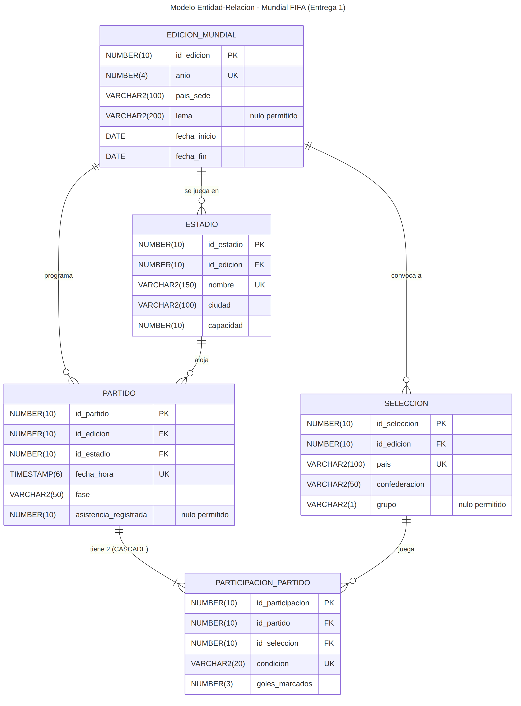
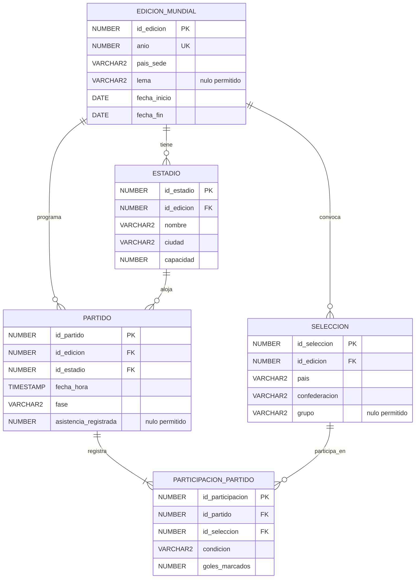

# Documento Técnico - Entrega 1
## Sistema de Información para la Gestión Integral de la Copa Mundial de la FIFA

**Alcance:** Modelo genérico inicial (5 entidades), según lo definido en la Sección 6 del enunciado del proyecto.

---

## 1. Descripción del problema y alcance del sistema

El presente proyecto tiene como propósito diseñar e implementar, sobre el motor Oracle, la primera fase de una base de datos relacional para la gestión de una edición de la Copa Mundial de la FIFA.

Esta entrega se desarrolla  a partir del modelo genérico inicial propuesto compuesto por cinco entidades: `EDICION_MUNDIAL`, `ESTADIO`, `SELECCION`, `PARTIDO` y `PARTICIPACION_PARTIDO`. El alcance de esta primera entrega cubre:

- El registro de distintas ediciones del torneo (año, país sede, fechas, lema).
- Los estadios asociados a cada edición (nombre, ciudad, capacidad).
- Las selecciones participantes en cada edición (país, confederación, grupo asignado).
- Los partidos programados dentro de una edición (fecha, hora, estadio, fase del torneo).
- La participación de cada selección en cada partido, registrando su condición
  (local/visitante) y los goles marcados.

No se incluyen en esta etapa jugadores, cuerpo técnico, árbitros, estadísticas individuales,
boletería, medios de comunicación ni incidencias operativas. Estos elementos, junto con la
expansión del modelo, se incorporarán en las Entregas 2 y 3 del proyecto, de acuerdo con el
análisis del documento de Evaluación Crítica del Modelo Inicial.

El sistema busca resolver, sobre este alcance reducido, necesidades reales de un organismo deportivo: identificar qué selecciones han marcado más goles, calcular la ocupación de los estadios, construir tablas de posiciones parciales, y garantizar la integridad de la información de cada partido (por ejemplo, que un partido no quede con más de un local o más de un visitante).

---

## 2. Supuestos de modelado adoptados por el equipo

1. **Cada partido debe tener exactamente dos participaciones asociadas** (una local, una visitante). Esta regla no puede garantizarse con una restricción `CHECK` simple en Oracle, ya que un `CHECK` solo puede evaluar la fila que se está insertando y no puede contar filas relacionadas en otra tabla. Por esta razón, la regla se controla parcialmente mediante restricciones `UNIQUE` (que impiden más de dos participaciones con la misma condición) y se verificará de forma completa mediante consultas de validación y, en entregas posteriores, mediante un trigger.

2. **Un registro de `ESTADIO` pertenece a una única edición.** Si el mismo estadio físico se usa en dos ediciones distintas del Mundial, se modela como dos registros distintos, uno por edición. 

3. **El atributo `fase` de `PARTIDO` es un valor controlado**, restringido mediante `CHECK` a una lista fija: Fase de Grupos, Dieciseisavos, Octavos, Cuartos, Semifinal, Tercer Puesto, Final.

4. **El atributo `condicion` de `PARTICIPACION_PARTIDO`** solo admite los valores `LOCAL` y `VISITANTE`, controlado mediante `CHECK`.

5. **Los goles marcados (`goles_marcados`) no pueden ser negativos** y se limitan a un rango de 0 a 15. Este tope no es arbitrario: corresponde a la mayor goleada individual registrada por una selección en la fase final de un Mundial (Hungría 10-1 sobre El Salvador, 1982), dejando margen suficiente y a la vez permitiendo detectar errores de digitación en los datos de prueba.

6. **Una selección no puede repetirse dos veces en el mismo partido con la misma condición** (por ejemplo, dos veces como local). Esto se garantiza con una restricción `UNIQUE` compuesta sobre `(id_partido, condicion)`, y de forma independiente se garantiza que una misma selección no aparezca dos veces en el mismo partido mediante `UNIQUE (id_partido, id_seleccion)`.

7. **El nombre de un país en `SELECCION.pais` puede repetirse entre ediciones distintas.** Por ejemplo, "Alemania" en la edición 2022 y "Alemania" en la edición 2026 son dos registros distintos e independientes, coherente con que `SELECCION` representa la participación de un país en una edición específica, no al país como entidad permanente. Por esta razón, la restricción de unicidad sobre `pais` es compuesta: `UNIQUE (id_edicion, pais)`.

8. **El campo `grupo` de `SELECCION` puede ser nulo**, para representar selecciones que aún no han sido asignadas a un grupo (por ejemplo, antes del sorteo) o que participan únicamente en fases eliminatorias. Cuando tiene valor, se restringe mediante una lista explícita de una sola letra (A a L) en lugar de un operador `BETWEEN`, porque `BETWEEN` sobre texto compara alfabéticamente y dejaría pasar valores inválidos como `'AB'` o `'Kansas'` por ubicarse alfabéticamente entre 'A' y 'L'.

9. **El campo `asistencia_registrada` de `PARTIDO` puede ser nulo**, ya que solo se conoce una vez el partido se ha jugado; los partidos aún no disputados no tienen este dato.

10. **Un estadio no puede tener dos partidos programados a la misma fecha y hora**, controlado mediante `UNIQUE (id_estadio, fecha_hora)`. Esto no impide que existan partidos simultáneos en la misma edición, siempre que se jueguen en estadios distintos.

11. **Una edición del Mundial debe durar al menos 7 días.** Un torneo de esta envergadura se disputa a lo largo de varias semanas, nunca en un solo día; esta restricción ayuda a detectar fechas de inicio o fin mal digitadas en los datos de prueba.

12. **Los campos de texto obligatorios no deben quedar en blanco.** Una restricción `NOT NULL` por sí sola no impide que alguien inserte una cadena compuesta solo de espacios (`'   '`), ya que técnicamente no es nula. Por eso se añadieron restricciones `CHECK (TRIM(columna) IS NOT NULL)` sobre los campos de texto más sensibles (`pais_sede`, `nombre` y `ciudad` de estadio, `pais` de selección), para exigir contenido real.

---

## 3. Diagrama Entidad-Relación (ERD)
"Respecto al modelo base el equipo decidió añadir dos atributos: grupo en SELECCION y asistencia_registrada en PARTIDO, esto se justifica porque se consideran necesarios para resolver consultas explícitamente pedidas en el enunciado, sin alterar la estructura de entidades ni relaciones del modelo original."

---

## 4. Transformación a modelo lógico relacional

### 4.1 Llaves primarias (PK)

Cada entidad utiliza un identificador artificial (*surrogate key*) de tipo `NUMBER(10)` en lugar de una llave natural (por ejemplo, el nombre del país o del estadio), porque los nombres pueden repetirse entre ediciones distintas (ver Supuesto 7) o pueden estar sujetos a cambios de
escritura. Esto garantiza estabilidad de la llave primaria a lo largo del ciclo de vida de los datos.

- **`EDICION_MUNDIAL.id_edicion`**: identifica cada edición del torneo de forma única.
- **`ESTADIO.id_estadio`**: identifica cada registro de estadio dentro de una edición (ver
  Supuesto 2 sobre la limitación de este enfoque).
- **`SELECCION.id_seleccion`**: identifica la participación de un país en una edición
  específica, no al país como entidad permanente.
- **`PARTIDO.id_partido`**: identifica cada encuentro del torneo.
- **`PARTICIPACION_PARTIDO.id_participacion`**: identifica cada fila de la entidad asociativa
  que resuelve la relación muchos a muchos entre `PARTIDO` y `SELECCION`.

### 4.2 Llaves foráneas (FK) y comportamiento ON DELETE / ON UPDATE

| Llave foránea | Referencia | ON DELETE | Justificación |
|---|---|---|---|
| `ESTADIO.id_edicion` | `EDICION_MUNDIAL(id_edicion)` | RESTRICT (comportamiento por defecto en Oracle) | No se debe poder eliminar una edición si ya tiene estadios registrados; se perdería información estructural del torneo. |
| `SELECCION.id_edicion` | `EDICION_MUNDIAL(id_edicion)` | RESTRICT (por defecto) | Una edición con selecciones ya registradas no debe poder eliminarse sin control explícito. |
| `PARTIDO.id_edicion` | `EDICION_MUNDIAL(id_edicion)` | RESTRICT (por defecto) | Un partido siempre debe pertenecer a una edición existente; no puede quedar huérfano. |
| `PARTIDO.id_estadio` | `ESTADIO(id_estadio)` | RESTRICT (por defecto) | Un estadio que ya tiene partidos programados no debe poder eliminarse, para no perder trazabilidad del calendario. |
| `PARTICIPACION_PARTIDO.id_partido` | `PARTIDO(id_partido)` | **CASCADE** | Una participación no tiene sentido sin su partido asociado: si el partido se elimina, sus dos participaciones (local y visitante) se eliminan automáticamente junto con él. |
| `PARTICIPACION_PARTIDO.id_seleccion` | `SELECCION(id_seleccion)` | RESTRICT (por defecto) | No se debe poder eliminar una selección que ya jugó partidos, porque se perdería el historial deportivo del torneo. Esta es una restricción explícita del enunciado del proyecto (Sección 8.1.2). |

Se utiliza `RESTRICT` (comportamiento por defecto de Oracle al no especificar `ON DELETE`) como
regla general del modelo, reservando `CASCADE` únicamente para la relación
`PARTICIPACION_PARTIDO → PARTIDO`, que es la única donde el registro hijo no tiene ningún
significado independiente de su padre.

### 4.3 Cardinalidades

- **`EDICION_MUNDIAL (1) — (N) ESTADIO`**: una edición tiene muchos estadios asociados; cada
  registro de estadio pertenece a exactamente una edición.
- **`EDICION_MUNDIAL (1) — (N) SELECCION`**: una edición convoca muchas selecciones; cada
  registro de selección pertenece a exactamente una edición.
- **`EDICION_MUNDIAL (1) — (N) PARTIDO`**: una edición programa muchos partidos.
- **`ESTADIO (1) — (N) PARTIDO`**: un estadio aloja muchos partidos dentro de la misma edición.
- **`PARTIDO (1) — (N) PARTICIPACION_PARTIDO`**: cada partido tiene, por regla de negocio,
  exactamente dos participaciones (ver Supuesto 1).
- **`SELECCION (1) — (N) PARTICIPACION_PARTIDO`**: una selección participa en muchos partidos
  a lo largo del torneo.

La relación real de muchos a muchos entre `PARTIDO` y `SELECCION` (un partido involucra dos
selecciones; una selección juega muchos partidos) se resuelve mediante la entidad asociativa
`PARTICIPACION_PARTIDO`, que además almacena los atributos propios de esa relación (condición y
goles marcados).

---

## 5. Diccionario de datos

El diccionario de datos completo (atributos, tipos, restricciones y descripciones de las 5
tablas del modelo) se encuentra en [`diccionario_datos.md`](diccionario_datos.md), dentro de
esta misma carpeta.

**Restricciones de unicidad compuesta adicionales**:

- `UNIQUE (id_partido, id_seleccion)`: una selección no puede aparecer dos veces en el mismo
  partido.
- `UNIQUE (id_partido, condicion)`: un partido no puede tener dos locales ni dos visitantes.

**Índices adicionales:** se crearon índices sobre `PARTIDO.id_edicion` y
`PARTICIPACION_PARTIDO.id_seleccion`, ya que Oracle no genera automáticamente un índice para las llaves foráneas (solo para PK y restricciones UNIQUE), y estas dos columnas se usan frecuentemente en las condiciones `JOIN` de las consultas del proyecto.

**Reglas de negocio no implementables mediante CHECK:** dado que una restricción `CHECK` en Oracle solo puede evaluar los valores de la fila que se está insertando (no puede consultar otras tablas ni contar filas relacionadas), las siguientes reglas quedan documentadas para verificarse mediante consultas de validación y, en la Entrega 3, mediante triggers:

1. Todo partido debe tener exactamente dos participaciones asociadas (las restricciones
   `UNIQUE` garantizan que no haya más de dos, pero no obligan a que existan exactamente dos).
2. La fecha y hora de un partido debe estar dentro del rango `fecha_inicio`–`fecha_fin` de su
   edición correspondiente.
3. El estadio asignado a un partido debe pertenecer a la misma edición del partido.
4. Las dos selecciones que participan en un partido deben pertenecer a la misma edición del
   partido.
5. Cada grupo de la fase inicial debe tener exactamente 4 selecciones asignadas (exige contar
   filas relacionadas, algo que un CHECK no puede hacer).
6. La asistencia registrada de un partido no puede superar la capacidad de su estadio (el
   aforo está en otra tabla, y un CHECK no puede consultarla).
7. Una misma selección no puede tener dos partidos programados a la misma fecha y hora (exige
   comparar filas entre sí).
8. En fase eliminatoria no puede haber empate: el resultado siempre debe definir un ganador
   (exige comparar las dos participaciones de un mismo partido entre sí).
