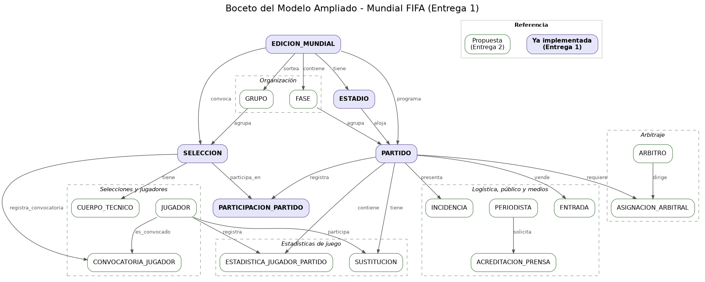

# Evaluación Crítica del Modelo Inicial
## Sistema de Información para la Gestión Integral de la Copa Mundial de la FIFA

- Análisis del modelo genérico inicial de 5 tablas: qué se queda corto y qué se va a ajustar.
- No se implementa nada de esto todavía, solo se plantea.
- El desarrollo completo queda para la Entrega 2.

---
## Problemas identificados y ajustes propuestos

- El atributo `fase` de `PARTIDO` es hoy un simple texto restringido por una lista fija (`CHECK`),
lo que sirve para validar el nombre de la fase pero no dice nada sobre el orden del torneo ni
sobre qué partido alimenta a cuál en las eliminatorias. No hay manera, por ejemplo, de preguntar
quién avanzó de un partido de octavos hacia el de cuartos, porque esa relación simplemente no
existe en el modelo. Para la Entrega 2 se plantea convertir `fase` en una entidad propia
(`FASE`), con un orden o nivel asociado, y agregar una relación de "avanza hacia" entre partidos
que permita reconstruir el árbol de eliminación completo.

- Las restricciones `UNIQUE (id_partido, condicion)` y `UNIQUE (id_partido, id_seleccion)` evitan
que un partido termine con tres participaciones o con dos locales, pero no obligan a que existan
las dos que sí debe tener. Un partido recién creado, sin ninguna participación registrada, es
perfectamente válido para el motor de base de datos aunque no tenga sentido de negocio. Esta es
una de las reglas que ya quedaron documentadas en el documento técnico como no implementable
mediante `CHECK`; su solución definitiva llegará con un trigger en la Entrega 3, mientras tanto
se verifica con una consulta de validación aparte.

- El modelo actual guarda los goles a nivel de selección (`PARTICIPACION_PARTIDO.goles_marcados`),
no por jugador, así que no hay forma de saber quién anotó, quién asistió o quién vio una tarjeta.
El enunciado pide justamente ese tipo de reporte en su sección de estadísticas de juego, algo que
el modelo de 5 tablas no puede entregar todavía. Se van a incorporar las entidades `JUGADOR`,
`CONVOCATORIA_JUGADOR` (para relacionar distintos jugadores con cada edición sin duplicar
historial) y `ESTADISTICA_JUGADOR_PARTIDO`.

- `SELECCION.grupo` es solo una letra validada contra una lista fija, lo cual impide valores como
"AB" pero no impide que un grupo termine con cinco selecciones o con solo tres. Contar cuántas
selecciones hay en un grupo exige comparar varias filas entre sí, algo que un `CHECK` no puede
hacer sobre una sola fila. La solución planteada es convertir `grupo` en una entidad `GRUPO`
propia, con llave foránea desde `SELECCION`, lo que de paso permite guardar metadatos que hoy no
tienen dónde vivir, como si el grupo ya fue sorteado o no.

- Nada en el modelo impide hoy que un partido use un estadio de otra edición, o que participen
selecciones que no jugaron esa misma edición ya que cada llave foránea valida que el registro
referenciado exista, pero no que coincida en edición con el resto del partido. Es una validación
que cruza tres tablas a la vez, y por eso queda fuera del alcance de un `CHECK`. Para el modelo
ampliado se van a reforzar estas relaciones con restricciones adicionales que obliguen a que
edición, estadio y selecciones coincidan entre sí, evitando referencias que sean válidas por
integridad referencial pero incorrectas desde el punto de vista del dominio.

- Por último, `PARTIDO.asistencia_registrada` no se compara en ningún lado contra
  `ESTADIO.capacidad`, porque viven en tablas distintas y un `CHECK` solo ve la fila que se está
  insertando. Por el momento es técnicamente posible insertar una asistencia mayor a la capacidad
  del estadio sin que nada lo impida. Para el modelo ampliado se va a incorporar una validación
  que compare ambos valores, de forma que no se puedan registrar asistencias mayores a la
  capacidad real del estadio.

---

## Boceto del modelo ampliado

Se mantienen las 5 entidades actuales tal como están. Lo que se agrega es lo que salió tanto de
los problemas de arriba como del resto del dominio que pide la sección 7 del enunciado
(selecciones y jugadores, arbitraje, logística, público, medios e incidencias).

**Entidades nuevas:** `FASE`, `GRUPO`, `JUGADOR`, `CUERPO_TECNICO`, `CONVOCATORIA_JUGADOR`,
`ARBITRO`, `ASIGNACION_ARBITRAL`, `ESTADISTICA_JUGADOR_PARTIDO`, `SUSTITUCION`, `ENTRADA`,
`PERIODISTA`, `ACREDITACION_PRENSA`, `INCIDENCIA`.

`AUDITORIA_EVENTO` queda por fuera de este diagrama a propósito: no depende de una sola entidad,
sino que registra cambios sobre cualquier tabla crítica del sistema, así que su diseño se define
mejor cuando ya exista el modelo completo, en la Entrega 2.
